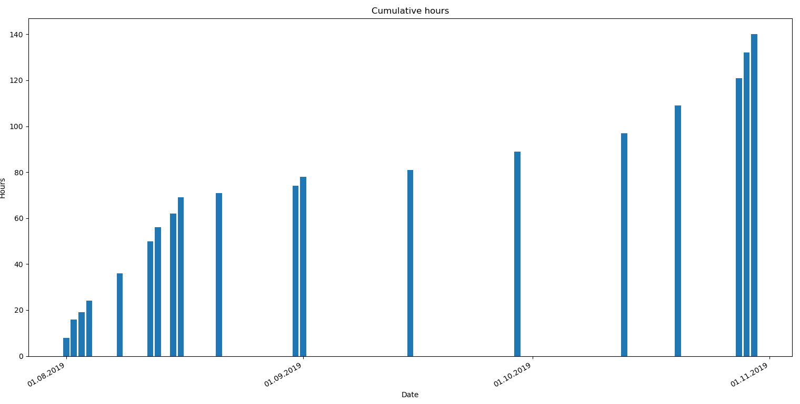
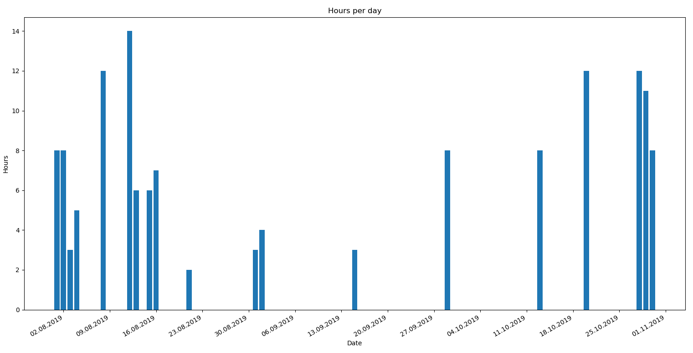
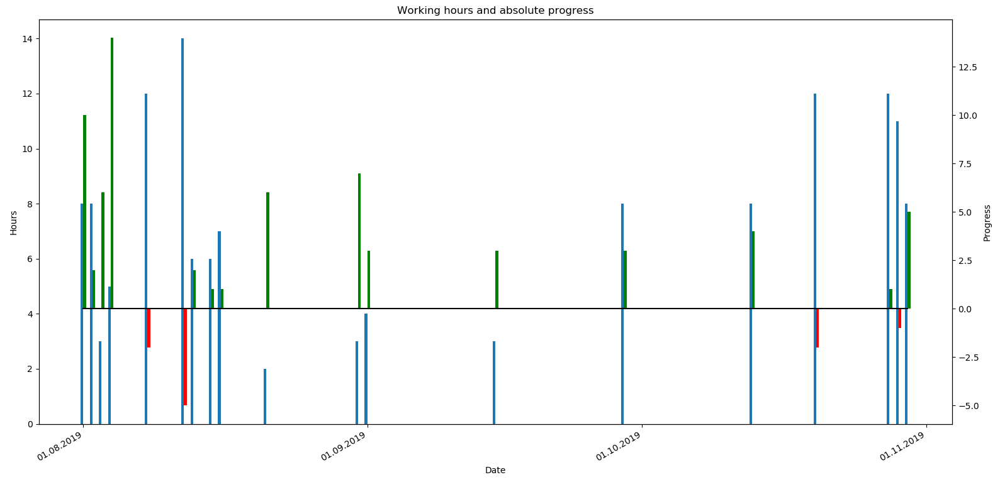
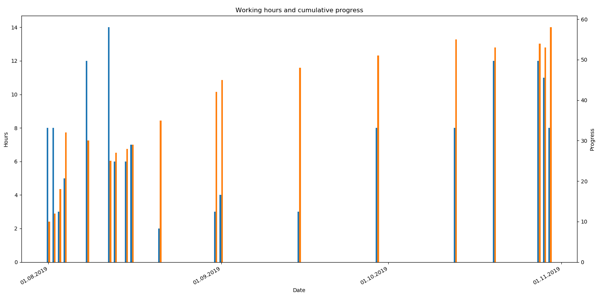

# Work Hours Timeline

## 1 Introduction

This script visualizes working hours on timeline. It also calculates the cumulative working hours and shows it as well. Here are some images to show the output.


The first graph shows hours done in each marked day.



The second graph shows cumulative hours in each marked day.



The third graph is the same as the first one but shows denser timeline which can be defined by changing the constant variables defined in the beginning of the code.



The forth graph shows hours and progress made during the process. Progress could be total amount of money, savings, revenue or number of written words in thesis. By changing the "Progress" name of a cell in CSV file, that word will be used in the graph. Progress is given as a cumulative value in the CSV file, for example, the amount of money is written there, not the growth of money.



The fifth graph shows hours and cumulative progress.

## 2 Installation

1. Install Python. Python 3.6 has been used during development but this should work with all Python 3 versions.

1. Install libraries: `pip install -r requirements.txt`

## 3 Running the Code

The code needs to know the file name and delimiter used in a CSV file. These could be changed directly inside the code or another option is to give them as command line arguments. Run the code from bash in a following way:

```bash
python script.py <file_name> <delimiter>
```

Examples:

```bash
python analyze_work.py work_hours.csv ,
python analyze_work.py work_hours.csv
python analyze_work.py
```

```bash
python analyze_work.py progress.csv ,
python analyze_work.py progress.csv
python analyze_work.py
```
